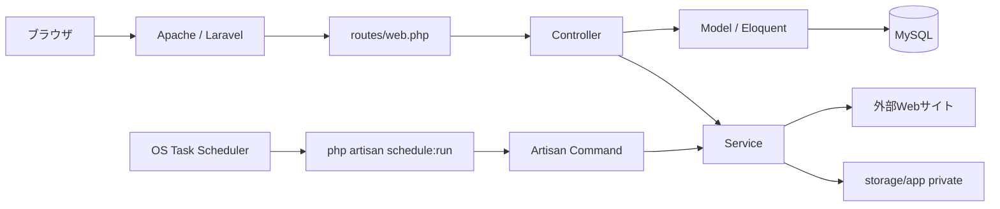
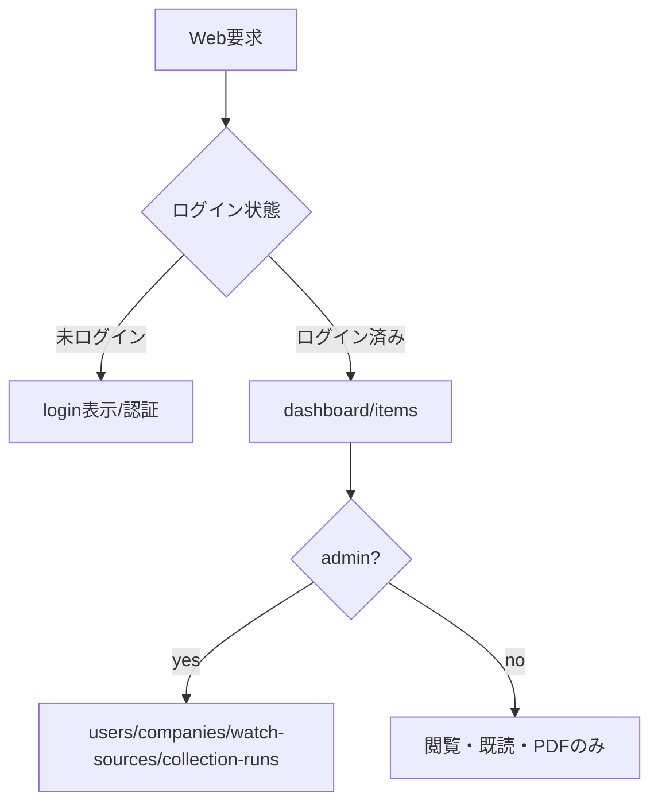
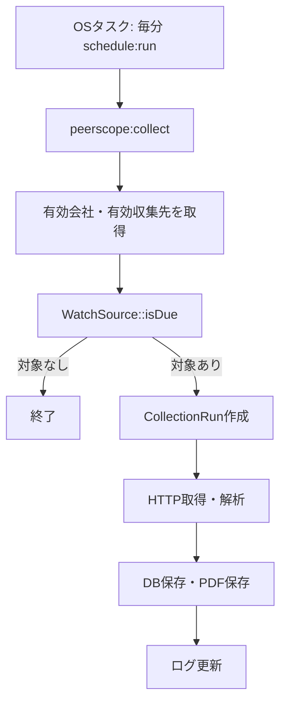
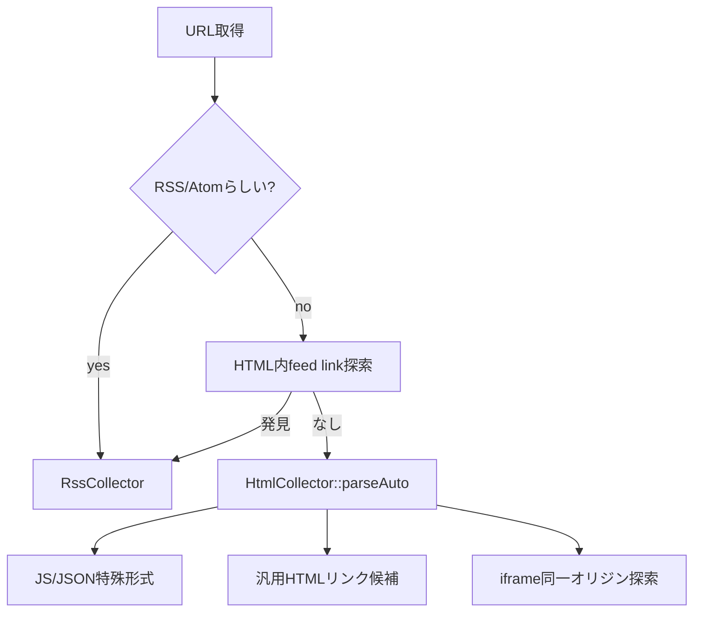
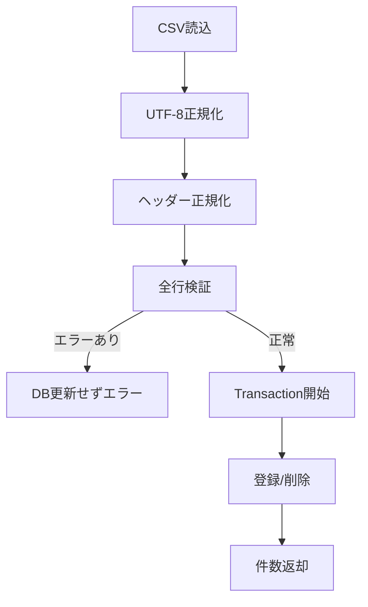

# PeerScope システム仕様書

- 文書版数: 1.1
- 更新日: 2026-06-18
- 対象リポジトリ: `lilivera/PeerScope`
- 反映元コミット: `929df22` / Improve watch source scheduling and auto detection
- 登録先: `lilivera/test`

## 改版履歴

| 版数 | 日付 | 内容 |
|---|---|---|
| 1.0 | 2026-06-16 | 初版作成。要件定義、基本設計、機能設計、DB設計、クラス設計、処理フロー、テスト計画を作成。 |
| 1.1 | 2026-06-18 | バージョンアップ反映。URL自動判定収集、スケジュール方式拡張、毎分Scheduler、WatchSource期限判定、運用・障害対応観点を更新。 |

## 1. 文書概要

PeerScopeは、同業他社のWebサイトに掲載される新着情報を収集し、社内ユーザーが確認・検索・既読管理するためのLaravelアプリケーションである。XAMPP Apache配下で `http://localhost/PeerScope` として動作し、MySQLを使用する。

本書は、運用部門が障害時に一次切分けを行えること、開発者が改造時に影響範囲を追跡できることを目的として、要件、設計、DB、クラス、接続、処理フロー、試験観点を整理する。

## 2. バージョンアップ反映事項

| No | 区分 | 内容 | 反映箇所 |
|---:|---|---|---|
| 1 | 収集方式 | `source_type=auto` が標準候補となり、RSS/Atom、HTML内feed link、既知JS/JSON形式、汎用HTML一覧を順に判定する。 | 収集先設計、NewsCollectorService、HtmlCollector処理フロー |
| 2 | スケジュール | `interval`、`daily`、`weekly`、`monthly` の実行方式を持つ。時刻、曜日、月日で期限判定する。 | watch_sources、WatchSource::isDue、Scheduler設計 |
| 3 | Scheduler | OS側は毎分 `php artisan schedule:run` を起動し、Laravel側で `peerscope:collect` と `peerscope:import-users-folder` を毎分確認する。 | SI計画、運用監視、障害切分け |
| 4 | 手動収集 | Web画面から手動収集する場合、先にCollectionRunを作成し、別プロセスで `peerscope:run-collection` を起動する。 | 接続フロー、ログ監視、切戻し |
| 5 | PDF保存 | PDF URLはprivateディスクへ保存し、認証済みダウンロード経路のみで取得する。 | セキュリティ、障害対応、容量監視 |
| 6 | CSV取込 | 画面アップロードとフォルダ配置CSV取込を同じサービスで検証・登録する。 | 運用手順、チェックリスト |

## 3. 要件定義

### 3.1 業務要件

- 同業他社のWebサイトに掲載される新着情報を定期的に収集する。
- 収集済み記事を会社、掲載日、検知日、キーワード、既読状態で検索できる。
- 記事詳細を開いた時点で既読化し、ユーザー別の確認状況を管理する。
- 管理者はユーザー、会社、収集先、収集ログを管理できる。
- 収集エラーを記録し、運用部門がエラー会社・収集先・エラー内容を確認できる。
- PDFリンクは自動保存し、認証済みユーザーだけがダウンロードできる。
- ユーザーは画面登録、CSVアップロード、フォルダ配置CSVから取り込める。

### 3.2 機能要件

| 機能 | 要件 |
|---|---|
| 認証 | メールアドレスではなく `login_id` とパスワードでログインする。 |
| 権限 | `admin` と `user` の2ロール。管理画面はadminのみ利用可能。 |
| ダッシュボード | 本日新着、未読、直近収集、24時間エラー、会社別件数、最近の新着を表示する。 |
| 新着一覧 | キーワード、会社、掲載日、検知日、既読状態で絞り込む。 |
| 新着詳細 | 本文/概要、元URL、PDF、既読化を扱う。 |
| 会社管理 | 会社名、公式URL、メモ、有効状態を管理する。 |
| 収集先管理 | URL、収集方式、CSSセレクタ、スケジュール、有効状態を管理する。 |
| 収集処理 | RSS/Atom、HTML、JavaScript配列、JSON一覧、自動判定を処理する。 |
| CSV取込 | 画面CSVアップロードとフォルダ配置CSVに対応する。 |
| 収集ログ | 実行状態、件数、メッセージ、エラー明細を確認する。 |

### 3.3 非機能要件

| 分類 | 要件 |
|---|---|
| セキュリティ | 認証済みユーザーのみ閲覧可能。管理機能はadminのみ。PDFはprivate保存。 |
| 可用性 | 1収集先の失敗で全体収集を停止しない。エラーはログ化する。 |
| 保守性 | Controller、Model、Service、Commandを分離し、収集方式追加時の影響を局所化する。 |
| 運用性 | Scheduler、ログ、エラー、PDF保存先、CSV取込フォルダを確認できること。 |
| 性能 | 一覧はページングし、収集ログは進捗更新間隔を抑制する。 |
| 監査性 | `collection_runs` / `collection_errors` に実行結果とエラーを残す。 |

## 4. 基本設計

| 層 | 構成 | 内容 |
|---|---|---|
| クライアント | Webブラウザ | ログイン、一覧、詳細、管理画面を利用する。 |
| Web/AP | XAMPP Apache + PHP 8.2+ + Laravel 12 | Webルーティング、認証、管理画面、収集起動、PDFダウンロードを処理する。 |
| DB | MySQL | ユーザー、会社、収集先、記事、既読、ログ、エラー、取込設定を保存する。 |
| スケジューラ | OSタスクスケジューラ + Laravel Scheduler | 毎分 `schedule:run` を起動し、収集とCSV取込の実行条件を判定する。 |
| ストレージ | `storage/app` 配下 | PDFファイル、CSV取込フォルダ、処理済み・失敗ファイルを保存する。 |

### 4.1 権限設計

| ロール | 利用可能機能 |
|---|---|
| admin | ダッシュボード、新着一覧/詳細/PDF、ユーザー管理、CSV取込、会社管理、収集先管理、収集ログ、手動収集、テスト収集 |
| user | ダッシュボード、新着一覧/詳細/PDF、既読化 |

### 4.2 接続フロー



## 5. 機能設計

### 5.1 認証・セッション

- `AuthController` が `login_id` と `password` を検証する。
- `Auth::attempt` 成功時、セッションIDを再生成する。
- ログアウト時、認証解除、セッション破棄、CSRFトークン再生成を行う。

### 5.2 新着一覧・既読管理

- `CollectedItemController@index` が検索条件を受け取り、複合条件で絞り込む。
- LIKE検索では `%` と `_` をエスケープし、利用者入力がワイルドカードとして効きすぎないようにする。
- `show` と `markRead` は `ItemRead::firstOrCreate` を使用し、ユーザー別既読を重複登録しない。
- PDFは `downloadPdf` から `Storage::disk('local')->download()` で返す。

### 5.3 収集先管理

- `WatchSourceController` が会社、URL、収集方式、セレクタ、スケジュールを検証する。
- 作成時の既定値は `source_type=auto`、`schedule_type=daily`、`schedule_time=09:00`、有効状態である。
- `interval` の場合、時刻・曜日・月日設定はnull化する。
- `weekly` / `monthly` の指定値は数値リストとして正規化する。

### 5.4 収集処理

- `NewsCollectorService::collectDue` が有効会社に紐づく有効収集先を取得し、`WatchSource::isDue()` で実行対象を絞る。
- 収集単位として `CollectionRun` を作成し、実行中メッセージを更新しながら処理する。
- 1つの収集先で例外が出ても `CollectionError` に記録して他収集先は継続する。
- `url_hash` で同一URL、`content_hash` で同一内容を重複抑止する。
- PDFリンクは `PdfAttachmentDownloader` がprivate領域へ保存する。

### 5.5 Scheduler

- `routes/console.php` で `peerscope:collect` と `peerscope:import-users-folder` を毎分登録する。
- OSタスクスケジューラは毎分 `php artisan schedule:run` を起動する。
- 実際に処理するかどうかは、各CommandまたはModel側の条件判定に委ねる。

### 5.6 CSV取込

- `UserCsvImportService` がCSVの文字コード、ヘッダー、action、login_id、email、password、roleを検証する。
- 全行を事前検証し、1行でもエラーがあればDB更新しない。
- フォルダ取込では成功CSVをprocessedへ、失敗CSVをfailedへ移動し、`.error.txt` に理由を保存する。

## 6. 詳細設計

### 6.1 DB主要テーブル

| テーブル | 用途 | 主な項目 |
|---|---|---|
| `users` | ログインユーザー、権限、認証情報 | id, name, login_id, email, password, role |
| `companies` | 収集対象会社 | id, name, official_url, memo, is_active |
| `watch_sources` | 収集先URL、解析方式、実行スケジュール | company_id, source_url, source_type, selectors, schedule fields, last_crawled_at |
| `collected_items` | 収集済み記事、PDF保存情報 | title, url, url_hash, content_hash, published_at, detected_at, pdf fields |
| `item_reads` | ユーザー別既読 | user_id, collected_item_id, read_at |
| `collection_runs` | 収集実行ログ | started_at, finished_at, status, target_count, created_count, updated_count, error_count, message |
| `collection_errors` | 収集先単位のエラー | collection_run_id, watch_source_id, error_type, error_message, occurred_at |
| `user_import_settings` | CSVフォルダ取込設定 | is_enabled, scheduled_time, import_directory, processed_directory, failed_directory, last_run_at, last_result |

### 6.2 クラス設計

| クラス | 役割 | 改造時の注意 |
|---|---|---|
| `AuthController` | ログイン/ログアウト | 認証キーはlogin_id。email認証に戻さない。 |
| `DashboardController` | 集計表示 | 件数条件変更時はDB負荷を確認する。 |
| `CollectedItemController` | 一覧、詳細、既読、PDF | PDFはStorage経由の認証済み配信を維持する。 |
| `UserController` | ユーザー管理、CSV取込設定 | `admin`ログインIDはシステム管理者扱いで保護する。 |
| `WatchSourceController` | 収集先管理、テスト、手動収集 | スケジュール項目の正規化を崩さない。 |
| `WatchSource` | 収集方式、スケジュール期限判定 | schedule_type変更時はisDue回帰テスト必須。 |
| `NewsCollectorService` | 収集統括、保存、ログ更新 | 例外分離、進捗更新、PDF保存順序を維持する。 |
| `HtmlCollector` | HTML/JS/JSON/auto解析 | 収集対象サイト差異の影響が最も大きい。 |
| `RssCollector` | RSS/Atom解析 | 名前空間付きRSS/Atomに注意する。 |
| `UrlNormalizer` | URL正規化 | hash生成へ直結するため既存データ影響を確認する。 |
| `UserCsvImportService` | CSV検証・登録/削除 | 全件検証後反映の原則を維持する。 |

## 7. 各プログラム処理フロー

### 7.1 Web要求



### 7.2 スケジュール収集



### 7.3 自動判定収集



### 7.4 CSV取込



## 8. 障害対応・運用設計

| 事象 | 確認箇所 | 対応 |
|---|---|---|
| ログインできない | users、セッション、APP_KEY | ID存在、role、Hash状態、セッションテーブルを確認する。 |
| 新着が収集されない | OSタスク、schedule:run、collection_runs、watch_sources | タスク実行履歴、is_active、schedule_type、last_crawled_atを確認する。 |
| 特定会社だけ失敗 | collection_errors、watch_sources、外部サイトHTML/RSS | HTTPステータス、HTML変更、セレクタ、SSL/プロキシを確認する。 |
| PDF保存不可 | PDF URL、HTTP応答、storage権限 | URL末尾.pdf、Content-Type、容量、書込権限を確認する。 |
| CSV取込失敗 | failedフォルダ、`.error.txt`、CSVヘッダー | 文字コード、必須列、ID重複、admin対象外エラーを確認する。 |
| 画面表示異常 | Laravelログ、Blade、public/build、APP_URL/ASSET_URL | キャッシュ、ビルド成果物、URL設定を確認する。 |

## 9. 改造時の開発指針

| 改造内容 | 主な影響範囲 | 必須確認 |
|---|---|---|
| 収集方式追加 | WatchSourceController, WatchSource, NewsCollectorService, Collector系, DB | source_typeバリデーション、画面選択肢、テスト収集、重複判定。 |
| スケジュール仕様変更 | WatchSource, routes/console.php, Command, SI運用手順 | due判定、当日重複実行、withoutOverlapping。 |
| PDF保存仕様変更 | PdfAttachmentDownloader, CollectedItemController, Storage | private保存、認証済み配信、容量監視。 |
| CSV項目変更 | UserCsvImportService, UserController | 全件検証、ロール、admin保護、文字コード。 |
| DB項目追加 | migrations, models, views, tests | 既存データ移行、nullable/default、rollback。 |
| 一覧検索拡張 | CollectedItemController, indexes, view | SQL負荷、ページング、LIKEエスケープ。 |

## 10. テスト計画

| 区分 | 内容 |
|---|---|
| 単体テスト | UrlNormalizer、ContentHashService、RssCollector、HtmlCollector、UserCsvImportService。 |
| 機能テスト | 認証、一覧検索、既読化、PDF、管理画面、手動収集。 |
| 結合テスト | Scheduler、Command、DB、Storage、外部HTTP取得。 |
| 運用テスト | タスク停止、収集先エラー、CSV不備、PDF書込不可。 |
| 回帰テスト | auto収集、daily/weekly/monthly、ログ進捗、CSVフォルダ取込。 |

## 11. セットアップ要約

```bash
composer install
npm install
copy .env.example .env
php artisan key:generate
php artisan migrate --seed
npm run build
php artisan schedule:run
```

## 12. 本番運用注意

- `.env`、`vendor/`、`node_modules/`、PDF本体はGit管理対象外とする。
- DBはMySQL前提。SQLite運用は対象外。
- XAMPP環境ではApacheドキュメントルート配下の配置とURL設定を一致させる。
